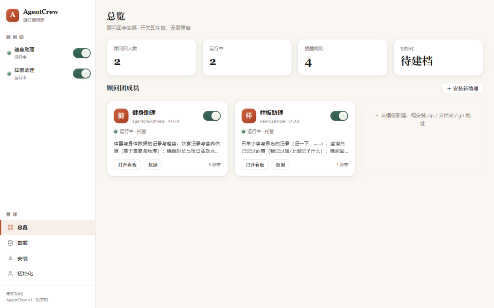
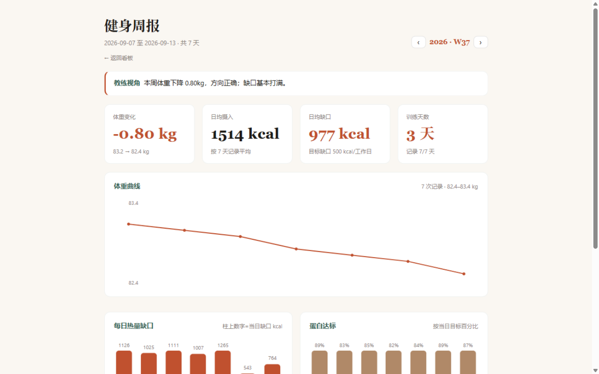
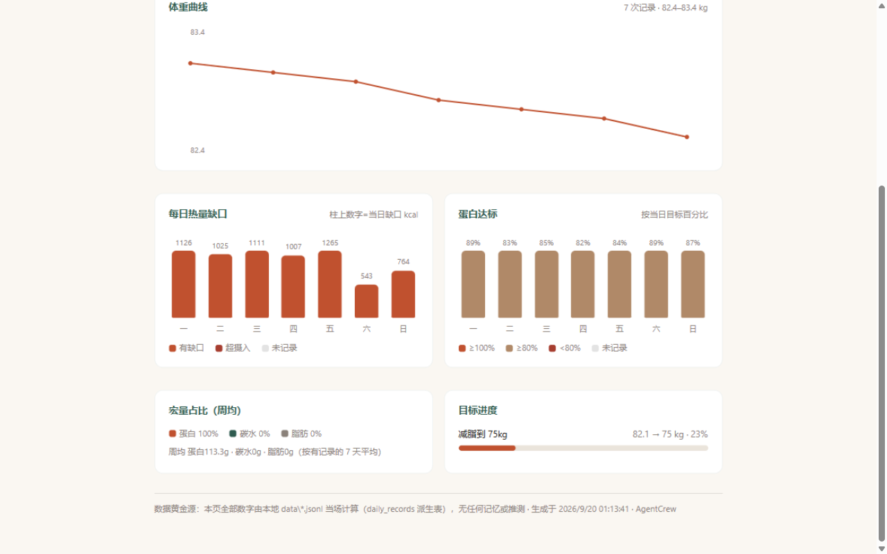
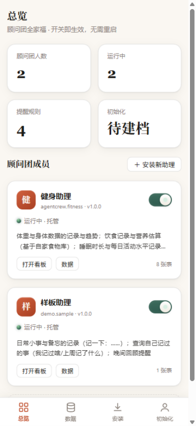
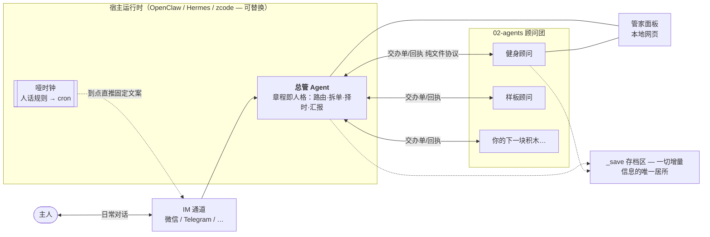
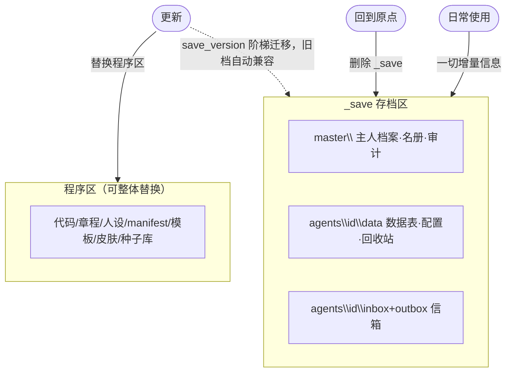

<div align="center">


# AgentCrew · 随行顾问团

**一位总管，率领一群随插随拔的 AI 顾问——你的数据只属于你。**

[](LICENSE)
[](https://www.python.org/)
[]()
[]()
[]()

*像雇佣一整个顾问团那样雇佣 AI —— 一位总管 + 一群随插随拔的顾问。*

[快速开始](#-快速开始) · [造一个新顾问](#-造你自己的顾问) · [存档架构](#-存档三定律) · [架构全文](docs/ARCHITECTURE.md)


</div>

---

## 为什么存在

市面上的 AI 助理要么是**一个全能巨佬**（什么都会，但你的所有数据搅在一口锅里），要么是**一堆散装工具**（各管各的，没有统一入口，也没有边界）。

AgentCrew 选择第三条路——**联邦制**：

- 一位**总管**守着唯一的对话入口：判断哪句话归谁管、给全家排提醒、在顾问之间做担保授权；
- 一群**子顾问**（健身、财务、职业……）各自是完整独立的"小公司"：有自己的章程、人设、工具、数据、看板——**搬进收编区就被总管管辖，搬出去就独立单干**，全程零配置；
- 一切数据存放在你自己的电脑上，人能直接打开看，**删掉存档文件夹，整个项目回到原点**——就像游戏的存档。

<div align="center"></div>

## ✨ 亮点

| | |
|---|---|
| 🧩 **随插随拔** | 顾问是完整独立项目。面板一键安装（模板/zip/文件夹/git 三式收编），拔出即独立运行（lite 模式），数据随它走 |
| 🏠 **数据本地说了算** | 一切增量信息只进 `_save\` 存档文件夹——明文可读、拷走即备份、删掉即回原点；程序区对运行时只读 |
| 🤝 **担保授权** | 顾问之间永不互窥数据；确有需要，总管来问你，你点头才给一份带有效期的只读快照 |
| 🔁 **换班管家模式** | 总管的全部状态在文件里——任何 AI 会话读章程即上岗。宿主随便换（OpenClaw/Hermes/zcode），公司不倒 |
| 📱 **IM 优先** | 日常在聊天软件里说一句就记录；提醒/日报按你的可推送时段送达，勿扰时段绝不打扰 |
| 🖥 **管家面板** | 本地网页管理台：顾问卡片墙+电源开关、数据浏览导出、存档告警、初始化表单 |

<div align="center">

### 管家面板（桌面）



### 健身顾问的周报（顾问自带看板）




### 手机上同样得体



</div>

## 🏗 它是怎么运转的



总管不是常驻程序，而是一份**章程**：任何 AI 会话（OpenClaw/Hermes/zcode）把工作区指到本文件夹，开机读章程即上岗——**管家换班，公司不倒**。顾问也不是插件，而是完整独立项目，和总管之间用**纯文件协议**（交办单/回执）通信——宿主、语言、运行时全部可替换。

> 📐 完整架构、生命周期时序、设计决策记录见 [docs/ARCHITECTURE.md](docs/ARCHITECTURE.md)。

## 🚀 快速开始

```bash
git clone https://github.com/August06exe/AgentCrew.git
cd AgentCrew
python 05-scripts/doctor.py        # 体检：环境就绪检查
```

**方式 A · 管家面板（推荐）**

```bash
# Windows：双击
04-panel/启动管家面板.bat          # → 浏览器自动打开 127.0.0.1:7530
```

**方式 B · 接入你的运行时（IM 日常使用）**

把本文件夹指给 OpenClaw / Hermes / zcode 的工作区——总管会主动发起**两轮初始化**（称呼与风格 → 推送时段与顾问启用），完成后正式上岗。Hermes 用户见 [docs/DEPLOY-hermes.md](docs/DEPLOY-hermes.md)。

**然后，像给朋友发消息一样用它：**

> 🗣 你：早饭吃了一碗牛肉面
> 🤖 总管：记好啦，早餐约 450 大卡，蛋白 27 克——存在健身顾问那儿。

**个人实例（生产姿势）**：框架仓库是"厂"，日常使用请生成你自己的家——

```bash
python 05-scripts/make-instance.py --to ../3004.1 --name my-home
```

一切增量信息（档案/数据/信箱）只落在实例的 `_save\` 里；程序更新替换 `_save\` 以外的部分即可，旧档自动兼容。

## 🧩 造你自己的顾问

不需要读框架代码。两种姿势：

1. **面板可视化**：安装页 →「从模板新建」→ 填 id/名字/一句话描述 → 自动收编；
2. **丢给 AI**：把 [`03-template/`](03-template/) 和 [`00-docs/PARADIGM.md`](00-docs/PARADIGM.md) 交给任意 AI："照这个范式给我造一个读书助理"。

范式核心：一个顾问 = `manifest.json`（身份/领域/正反例路由/数据表/人话提醒）+ 章程（双模式自查：有总管听总管，没总管自己当家）+ 人设 + 工具（仅标准库、必须过 `--selfcheck`）+ 可选看板。收编时八项校验自动执行，**总管代码零改动**。

## 💾 存档三定律

游戏化设计：**程序是游戏，`_save\` 是存档**。



1. **一切增量信息只进 `_save\`** ——数据表、配置、信箱、主人档案；明文 JSONL，人能直接打开读；
2. **程序更新兼容旧存档** ——`save.json` 版本化 + 阶梯迁移；旧档读不了算程序的 bug；
3. **删档回原点** ——`python 05-scripts/save.py reset`（二次确认）或直接删文件夹；
4. **有人不守规矩？** `save.py watch` 确定性扫描程序区违规增量——工具层硬约束，不靠 LLM 自觉。

## 📦 收编与放归

```bash
python 05-scripts/adopt.py --zip some-agent.zip     # 三式安装：zip / 文件夹 / git 地址
python 05-scripts/release.py some-agent             # 放归：移出收编区，回 lite 独立模式
```

顾问住在收编区 `02-agents\` = 被总管管辖（托管模式）；单独拿走 = 自动变回独立单干（lite 模式）——**住不住在屋里就是管辖信号**，零配置。

## ❓ FAQ

<details>
<summary><b>为什么要"总管 + 子顾问"，而不是一个大而全的助理？</b></summary>

边界。健身数据不该和记账搅在一口锅里；职业顾问不该偷看你的睡眠。联邦制让每个领域有自己的专家、自己的数据、自己的边界——需要协作时由总管做**担保授权**（你点头才给只读快照），而不是默认互通。
</details>

<details>
<summary><b>我的数据安全吗？会上云吗？</b></summary>

一切数据是**你电脑上的明文文件**，无云端、无遥测、无隐藏上传。备份=拷走文件夹；审计=直接打开看。安全底线写进章程与范式：默认禁止联网外发用户数据。
</details>

<details>
<summary><b>支持微信吗？</b></summary>

总管不绑定通道。部署到 Hermes 时官方支持微信/Telegram/飞书等 30+ 通道（见 DEPLOY-hermes 笔记）；OpenClaw/zcode 等任何能读 AGENTS.md 的运行时也能直接上岗。
</details>

<details>
<summary><b>电脑关机了提醒会丢吗？</b></summary>

提醒规则是源，注册的定时任务是投影——重启后总管按 manifest 自动重挂，错过的提醒开机补发（前缀"您错过了"），且遵守你的勿扰时段。
</details>

<details>
<summary><b>为什么我看到的界面长这样（暖纸+赤陶土）？</b></summary>

设计系统来自 OpenDesign 官方库的 `warm-editorial`（暖纸编辑风）。不喜欢？设计规格集中在各看板的 `DESIGN.md`，改一处全家族生效——或者让 AI 帮你换一套。
</details>

## 🗺 路线图

- [x] v0.1 — 总管章程 / 子顾问范式 / 双模式 / 文件协议 / 担保授权 / 管家面板 / 存档架构
- [x] 健身顾问 v1（范式首个正式产物：营养/代谢/目标/周报/看板）
- [ ] 存档导出/导入为单文件（.sav 式跨机迁移）
- [ ] 更多通道顾问：财务、读书、职业规划……（照范式复制粘贴级开发）
- [ ] 顾问市场：社区发布的顾问一键收编
- [ ] 移动端 PWA 面板

> 路线图遵循存档架构承诺：**任何新能力都不破坏旧存档**。

## 🙏 致谢与出处

- 界面设计系统：OpenDesign 官方库 `warm-editorial`（暖纸编辑风）与 `DESIGN.md` 方法论
- 存档巡检/架构灵感：游戏行业的程序-存档分离实践
- 健身领域算法（BMR/TDEE/缺口策略）参考了社区通行的 Mifflin-St Jeor 公式与减脂实践

## License

[MIT](LICENSE) © AgentCrew contributors

---

<div align="center">
<sub>如果这个项目对你有用，欢迎点个 ⭐ —— 让更多人的 AI 顾问团有章可循。</sub>
</div>
