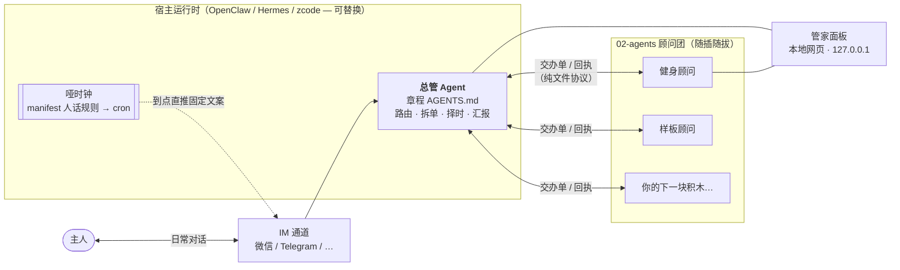
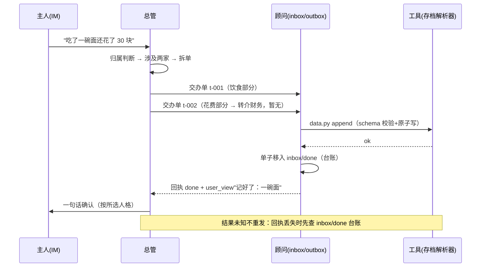
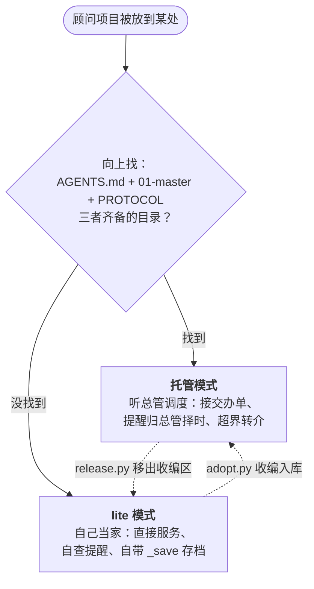
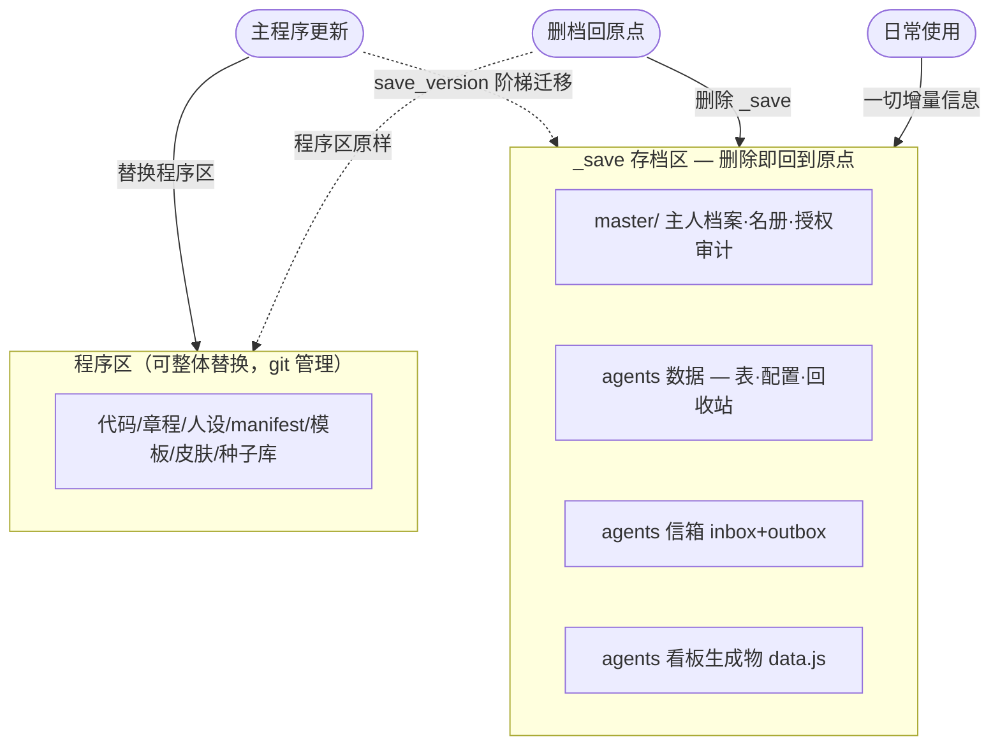

# 架构 — AgentCrew 是怎么运转的

> 本文面向想读懂/改代码的开发者。只想用 → 看 [README](../README.md)；想造自己的助理 → 看 [PARADIGM](PARADIGM.md)。

## 总览

三个角色，三种"存在方式"：

| 角色 | 存在方式 | 谁读它 |
|---|---|---|
| 总管 | 一份章程（AGENTS.md）+ 存档里的名册与档案 | 任何 AI 会话读章程即上岗 |
| 顾问 | 完整的独立项目（manifest+章程+人设+工具+看板） | 交办单来了就干活 |
| 存档 | `_save\` 文件夹（一切增量信息） | 只有工具经解析器读写 |

## 一次对话的生命周期

## lite / 托管：位置即管辖

判定是**纯目录事实**，无配置文件参与——搬动即切换。

## 存档三定律（程序与存档分离）

- `save.json` 记录 `save_version`；`migrate_save.py` 阶梯升档（v1→v2→…）
- `save.py watch` 确定性扫描程序区违规增量（工具层硬约束，不靠 LLM 自觉）；doctor 体检含同款
- 速率型目标（kg/周类）不自动判达成——达成要主人亲口说

## 担保授权（顾问间数据互通的唯一通道）

顾问 A 想要 B 的数据 → 总管拿去问主人 → 主人点头 → `authz.py` 从 B 导出**只读快照**（来源/用途/24h 有效期）投进 A 的信箱 → 过期即清扫（`authz.py --sweep`）→ 全程审计进存档。顾问间私下互读 = 重大违规。

## 工具箱（05-scripts，仅 Python 标准库）

| 工具 | 干什么 |
|------|--------|
| `agentcrew_lib.py` | 公共库：路径判定/存档解析器/manifest 校验/原子写 |
| `adopt.py` / `release.py` | 收编（八项校验+存档并入）/ 放归（存档迁出回 lite） |
| `authz.py` | 担保授权快照 + 过期清扫 |
| `doctor.py` | 体检：结构/名册/顾问完整性/防腐/存档审计 |
| `dnd_check.py` | 可推送时段核验（注册 cron 前/触发前必查） |
| `save.py` / `migrate_save.py` | 存档 status/watch/reset / 阶梯迁移 |
| `make-instance.py` | 从框架生成个人实例（开发痕迹零携带） |

## 设计决策记录

- **为什么纯文件协议而不是 API 调用**：文件谁都能读——AI 会话、脚本、GUI、人。换宿主零改动。
- **为什么位置即管辖**：零配置，物理事实不可伪造；搬动即切换有测试背书。
- **为什么存档不进 git**：主人数据离开主人才是事故；程序区随时可公开。
- **设计系统**：界面采用 OpenDesign 官方库 `warm-editorial`（暖纸/赤陶土/森林绿），规格见 `02-agents/agentcrew.fitness/dashboard/DESIGN.md`。
